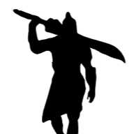
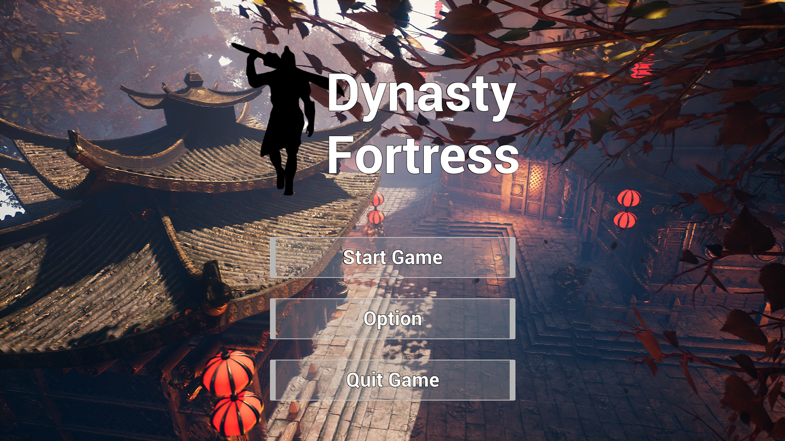
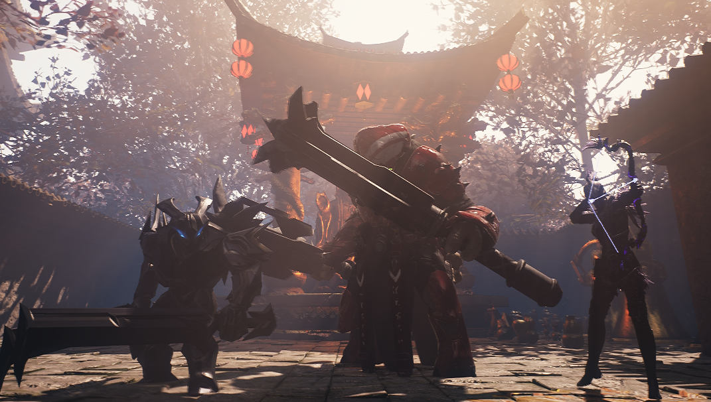
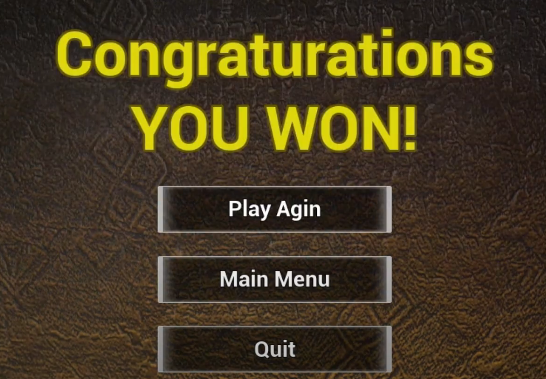
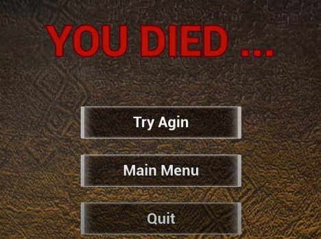

# Shrine Battle

 

## Ⅰ. 프로젝트 소개

### 개요

- GAS를 적용한 Unreal 5.4 개인 포트폴리오 입니다.

- 웨이브에 맞춰 적이 등장하고, 이를 무찌르며 모든 웨이브를 클리어 시 승리합니다.

### 기간 및 인원

- 2024.02 ~ 2024.4 (약 2개월)
- 1인 개발

 

## II. 참고 영상

### [유튜브 소개 영상](https://youtu.be/ISgb-UXCs9w?si=DeqBLjNdQxQivVgW)

 

## III. 기능 상세

### 플레이어 

#### 플레이어 이동 및 구르기
 

 

#### 플레이어 공격

 

 
<일반 공격>

 
<점프 공격>

 
<스킬 R>

#### 아이템 소비

#### 방어

#### 포커싱

 
포커싱 하는 몬스터로 시선을 고정. 마우스를 움직여 포커싱 대상을 변경할 수 있습니다.

### 몬스터

- 근접 몬스터 : 일반 공격과 대기 로직
- 원거리 몬스터 : 원거리 공격과 플레이어와의 거리 유지
- 보스 몬스터 : 높은 체력과 방어 불가능 공격, 일정 체력 소모 시 몬스터 소환

### 게임 로직

3개의 웨이브 마다 몬스터가 스폰되어 플레이어를 공격합니다. 웨이브를 전부 클리어 하기 전에 플레이어 사망 시 실패, 모든 웨이브를 클리어하면 성공입니다.

